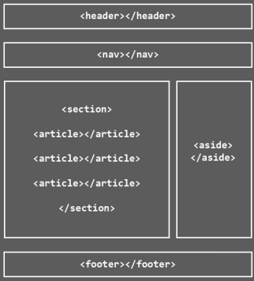

# TABLAS

- **¿Qué son?**
    - Las tablas están incluidas en HTML desde sus primeras versiones y son una forma fantástica de mostrar datos claramente.
    - Se utilizan para mostrar datos tabulados y listados de información organizada.
- Se deben utilizar **únicamente** para mostrar datos organizados de forma tubular con encabezados.
- Una tabla puede ser sencilla o compleja, dependiendo de nuestro objetivo y la cantidad de etiquetas o atributos a utilizar.

## Antiguo uso de las tablas.
- Antiguamente se usaban para maquetar estructuras de página complejas cuando CSS no era tan potente y sobre todo cuando los navegadores no lo soportaban todos por igual.
- La cabecera de la página era una fila de una gran tabla, el pie de página era otra fila de esta tabla,..

  

 

- A día de hoy se siguen usando para maquetar cosas muy espícficas como para correos electrónicos que tienen diseño y estructura.

- Framework "MJML" para maquetar correos electrónicos.
    > [!NOTE]
    > Enlace al Email Framework [Enlace al Email Framework](https://mjml.io/)

---
## `<table>`
- Englobará todo el contenido de la tabla.
- Etiqueta de bloque.
- Atributos comunes y eventos.
- Atributo propio: 
    - summury = "texto" que permite describir el contenido de la tabla para buscadores y accesibilidad.
    - Atributo border

 

  

 

### `<tr>`
- Modela una fila de la tabla en la que esté incluida.
- Etiquetas de bloque.
- Una tabla tendrá tantas etiquetas tr como filas tenga la tabla.

### `<th>`
- Celda de cabecera de fila o de columba
- Etiquetas de tipo nuevo, ni es de línea ni es bloque.
- Los navegadores suelen renderizar su contenido en negrita.
- Aporta semántica a nuestras tablas.

### `<td>`
- Celda común de tabla.
- Etiquetas de tipo nuevo, ni es de línea ni de bloque.
- Son las que contendrán los datos regulares de la tabla.
- Atributos específicos de fusión de celdas.
    - Colspan: para fusionar columnas
    - Rowspan: para fusionar filas

### `<caption>`
- Lo usaremos para indicar en texto el contenido de la tabla.
- Los navegadores accesibles lo usarán para dar una descripción de lo que pueden encontrar en la tabla.
- El navegador lo renderizará a modo de título de la tabla.

---
# Ejemplos prácticos sencillos
- [Ver código tabla cursos](tabla1_cursos.html)

- [Ver código tabla pedido](tabla2_pedido.html)

- [Ver código tabla ventas](tabla3_ventas.html)
