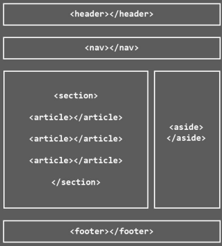
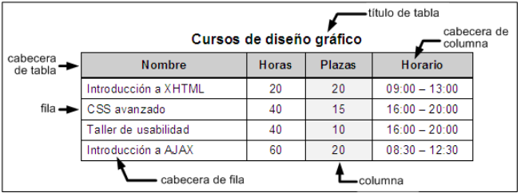
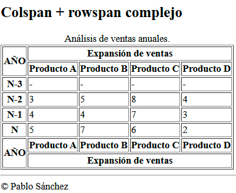

# TABLAS

- **¿Qué son?**
    - Las tablas están incluidas en HTML desde sus primeras versiones y son una forma fantástica de mostrar datos claramente.
    - Se utilizan para mostrar datos tabulados y listados de información organizada.
- Se deben utilizar **únicamente** para mostrar datos organizados de forma tubular con encabezados.
- Una tabla puede ser sencilla o compleja, dependiendo de nuestro objetivo y la cantidad de etiquetas o atributos a utilizar.


## Antiguo uso de las tablas.
- Antiguamente se usaban para maquetar estructuras de página complejas cuando CSS no era tan potente y sobre todo cuando los navegadores no lo soportaban todos por igual.
- La cabecera de la página era una fila de una gran tabla, el pie de página era otra fila de esta tabla,..

<div style="text-align: center;">
  
</div>
<br>

- A día de hoy se siguen usando para maquetar cosas muy espícficas como para correos electrónicos que tienen diseño y estructura.

- Framework "MJML" para maquetar correos electrónicos.
> [!NOTE]
>[Enlace al Email Framework](https://mjml.io/)

---
## `<table>`
- Englobará todo el contenido de la tabla.
- Etiqueta de bloque.
- Atributos comunes y eventos.
- Atributo propio: 
    - summury = "texto" que permite describir el contenido de la tabla para buscadores y accesibilidad.
    - Atributo border

<br>
<div style="text-align: center;">
  
</div>
<br>

### `<tr>`
- Modela una fila de la tabla en la que esté incluida.
- Etiquetas de bloque.
- Una tabla tendrá tantas etiquetas tr como filas tenga la tabla.

### `<th>`
- Celda de cabecera de fila o de columba
- Etiquetas de tipo nuevo, ni es de línea ni es bloque.
- Los navegadores suelen renderizar su contenido en negrita.
- Aporta semántica a nuestras tablas.

### `<td>`
- Celda común de tabla.
- Etiquetas de tipo nuevo, ni es de línea ni de bloque.
- Son las que contendrán los datos regulares de la tabla.
- Atributos específicos de fusión de celdas.
    - Colspan: para fusionar columnas
    - Rowspan: para fusionar filas

### `<caption>`
- Lo usaremos para indicar en texto el contenido de la tabla.
- Los navegadores accesibles lo usarán para dar una descripción de lo que pueden encontrar en la tabla.
- El navegador lo renderizará a modo de título de la tabla.

---
# Ejemplos prácticos sencillos
- [Ver código tabla cursos](tabla1_cursos.html)

- [Ver código tabla pedido](tabla2_pedido.html)

- [Ver código tabla ventas](tabla3_ventas.html)

- [Ver código tabla curso de diseño](tabla4_curso_diseño.html)

- [Ver código tabla desempleo](tabla5_desempleo.html)
---

### `<colspan>`
- Atributo de las celdas `<th>` y `<td>`
- Nos servirán para fusionar celdas adyacentes por columnas.
- Una tabla puede ser sencilla o compleja, dependiendo de nuestros objetivo y la cantidad de etiquetas o atributos a utilizar.
```html
<table>
        <tr>
            <th>Producto</th>
            <th>Precio</th>
            <th>Cantidad</th>
        </tr>
        <tr>
            <td>Manzanas</td>
            <td>$1.00</td>
            <td>10</td>
        </tr>
        <tr>
            <td>Naranjas</td>
            <td>$0.80</td>
            <td>20</td>
        </tr>
        <tr>
            <td colspan="2">Total</td>
            <td>$28.00</td>
        </tr>
    </table>
```

- [Ver código tabla colspan](tabla6_colspan.html)

---
### `<rowspan>`
- Atributo de las celdas `<th>` y `<td>`
- Nos servirán para fusionar celdas adyacentes por las filas.

```html
<table>
        <tr>
            <th>Nombre</th>
            <th>Edad</th>
            <th>Ciudad</th>
        </tr>
        <tr>
            <td rowspan="2">Juan</td>
            <td>25</td>
            <td>Madrid</td>
        </tr>
        <tr>
            <td>26</td>
            <td>Barcelona</td>
        </tr>
        <tr>
            <td>Carmen</td>
            <td>30</td>
            <td>Valencia</td>
        </tr>
</table>
```

- [Ver código tabla rowspan](tabla6_colspan.html)

---

### `<colspan>` + `<rowspan>`
- Consejos:
    - Contabilizar el total de filas.
    - Contabilizar total de columnas
    - Comprobar que la suma de td's + colspan dan el total de columnas por fila
    - Comprobar que la suma de tr + rowspan dan el total de filas por columna,

<br>
<div style="text-align: center;">
  
</div>
<br>

- [Ver código tabla imagen](tabla8_colspan-rowspan.html)


## Tablas semánticas
- Ayudan al igual que las etiquetas semánticas a ñadir significado a los datos tabulados.
- Dividiremos las tablas en tres partes.

<br>
<div style="text-align: center;">
  
</div>
<br>

### `<thead>`
- Aglutinará todas las filas con celdas de cabecera.
- Etiqueta hija de `<tbody>`
- Aporta semántica a nuestras tablas

### `<tbody>`
- Contendrá todas los datos de la tabla
- Después de `<thead>` siempre y cuando no exista `<tfoot>`

### `<tfoot>`
- Siempre antes del `<tbody>`
- Sirve para acumulados, contabilizaciones o repetir la cabecera.


### Ejemplo de tabla semántica.
- [Ver código tabla imagen](tabla9_semantica.html)

---