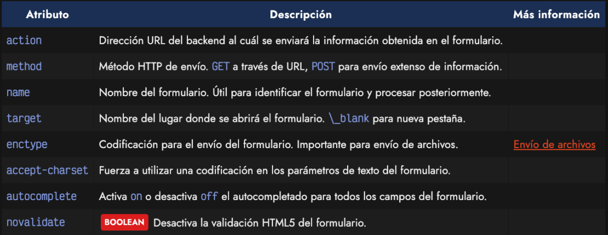
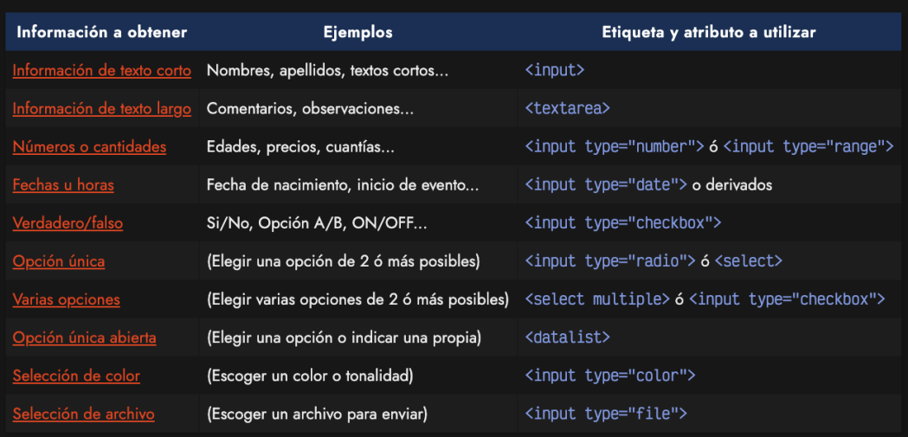
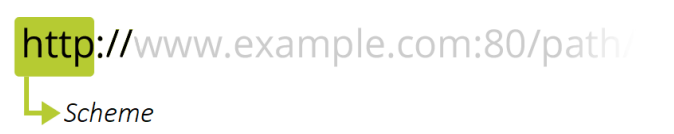
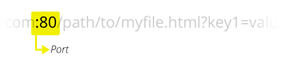
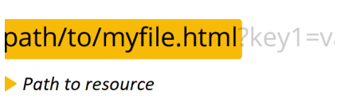
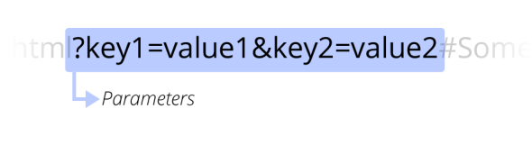
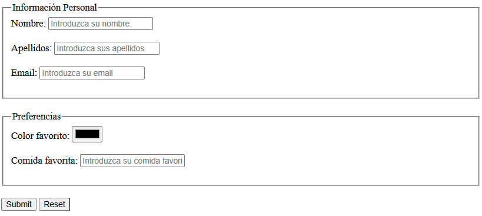

# FORMULARIOS
## ¿Qué es un formulario?
- Bloque con un conjunto de elementos de entrada de información.
- Es de las únicas formas en las que podemos enviar datos a un servidor.
- Se conoce como **formulario** a los mecanismos para enviar información por parte del usuario, a tracés de unos campos visuales de forma sencialla e intuitiva, que determinan la naturaleza del tipo de información que se va a enviar u como hacerla llegar a otro enxtremo donde se procesará esa información

### ¿Formulario más sencillo que se te pueda ocurrir?
<br>
<div style="text-align: center;">
  
</div>


## Objetivos
- Hacer lo más sencillo posible el proceso de inserción de datos por parte del usuario.
- Intentar que la experiencia de usuario sea lo más agradable y cómoda posible.
- Intetar que los datos introducidos estén en un formato predecible y esperado.
- Reducir los errores al introducir datos en la medida de lo posible
- Comunicar de forma clara y rápidamente si ocurren errores al introducir datos.

### Etiqueta `<form>`
- Etiqueta de bloque con atributos propios.
- Englobará todo el contenido del formulario.
- Pueden coexistir carios formularios en la misma página.

- Atributos propios:
<br>
<div style="text-align: center;">
  
</div>
<br>

- Información que puedes enviar en un formulario:
    - Texto
    - Email
    - Cantidades
    - Numéricos
    - Fechas
    - etc...
<br>
<div style="text-align: center;">
  
</div>
<br>

- Sintaxis de un formulario.
```html
<form action="/ruta-del-servidor" method="post">
    <!-- Campo de texto -->
    <label for="nombre">Nombre:</label><br>
    <input type="text" id="nombre" name="nombre"><br><br>

    <!-- Campo de correo electrónico -->
    <label for="email">Correo Electrónico:</label><br>
    <input type="email" id="email" name="email"><br><br>

    <!-- Campo de contraseña -->
    <label for="password">Contraseña:</label><br>
    <input type="password" id="password" name="password"><br><br>

    <!-- Campo de fecha -->
    <label for="fecha">Fecha de Nacimiento:</label><br>
    <input type="date" id="fecha" name="fecha"><br><br>

    <!-- Campo de selección -->
    <label for="genero">Género:</label><br>
    <select id="genero" name="genero">
        <option value="masculino">Masculino</option>
        <option value="femenino">Femenino</option>
        <option value="otro">Otro</option>
    </select><br><br>

    <!-- Casillas de verificación -->
    <label>Intereses:</label><br>
    <input type="checkbox" id="deportes" name="intereses" value="deportes">
    <label for="deportes">Deportes</label><br>
    <input type="checkbox" id="musica" name="intereses" value="musica">
    <label for="musica">Música</label><br>
    <input type="checkbox" id="tecnologia" name="intereses" value="tecnologia">
    <label for="tecnologia">Tecnología</label><br><br>

    <!-- Botón de envío -->
    <input type="submit" value="Enviar">
</form>
```

## Métodos de envío.

### Método GET
- Concatenación de variables en URL.
- Como máximo el envío de unos 500 bytes de información.
- No permite el envío de archivos adjuntos con el formulario.
- Los datos enviados se ven en la barra de direcciones del navegador.
- El símbolo **?** indica dónde empiezan los parámetros que se reciben desde el formulario que ha enviado los dtos a la página.
- Después del símbolo **?** aparecen parejas de datos con su nombre y valor separados por el símbolo **&** 
- Las parejas dato1=valor1, dato2=valor2... reflejan el bombre y el valor de los campos enviados por el formulario.
- Tener en cuenta que para separar la primera pareja de la dirección web en sí se usa el símbolo **?** y para separar las restantes parejas **&**
- Determinados caracteres no son recibidos en la URL de la forma exacta en que fueron escritos en el formulario.
- Se utilizan para formularios de consulta.
- No se usan para modificar ni crear registros.
- Ejemplo:
    ```url 
        www.facebook.com/registro?firstname=Pablo&lastname=Sanchez
    ```
    ```url 
        http://www.example.com:80/path/to/myfile.html?key1=value1&key2=value2#SomewhereInTheDocument
    ```
<div style="text-align: center;">
  
</div>

<div style="text-align: center;">
  
</div>

<div style="text-align: center;">
  
</div>

<div style="text-align: center;">
  
</div>

<div style="text-align: center;">
  
</div>
<br>

### Método POST
- Se envían de forma "oculta"
- Se pueden enviar una gran cantidad de datos a la vez.
- Permite enviar documentos adjuntos.
- Se usarán para acciones de creación, edición y borrado.
---
### CRUD
    Create -> método POST
    Read   -> método GET
    Update -> método POST
    Delete -> método POST

---
### Etiqueta `<input>`
- Elemento princpal donde poremos escribir la información que queremos enviar al servidor.
- Dependiendo de la naturaleza de los datos utilizaremos input de un tipo u otro.

    [Ver documentación etiqueta input "W3C"](https://www.w3schools.com/tags/tag_input.asp)

---

### Etiqueta `<label>`
- Se utiliza para definir una etiqueta para un elemento `<input>`
- Principal poósito es mejorar la accesibilidad y usabilidad.
- Ejemplos:
  - Asociar un `<label>` con un `<input>` mediante el atributo for:
    - El atributo for del `<label>` debe coincidir con el valor del atributo id del `<input>`. Esto crea una asociación explícita entre el campo de entrada y su etiqueta.
    ```html
    <label for="username">Username:</label>
    <input type="text" id="username" name="username" />
    ```
    - En este caso, hacer clic en el texto "Username:" enfoca el campo de entrada.

  - Incluir el `<input>` dentro del `<label>`:
    - Otra forma de asociar un `<label>` con un `<input>` es anidar el elemento `<input>` dentro del elemento `<label>`. Esta asociación implícita no requiere los atributos for e id.
    ```html
      <label>Username:
        <input type="text" name="username" />
      </label>
    ```
    - Al hacer clic en el texto "Username:", también se enfoca el campo de entrada.


  [Ver documentación etiqueta label "W3C"](https://www.w3schools.com/tags/tag_label.asp)


---
### Etiqueta `textarea`
-  Se utiliza para crear un área de texto de varias líneas donde los usuarios pueden ingresar texto.
-  A diferencia de la etiqueta `<input>` con **type="text"**, que solo permite una sola línea de texto, `<textarea>` permite al usuario escribir párrafos completos y textos más largos.
- Atributos más habituales: name, rows, cols,..

```html
<label for="textarea">Lorem Ipsum</label>
<textarea id="textarea" name="textarea" rows="4" cols="50">
Lorem Ipsum es simplemente el texto de relleno de las imprentas y archivos de texto. Lorem Ipsum ha sido el texto de relleno estándar de las industrias desde el año 1500
</textarea>
```

  [Ver documentación etiqueta texarea "W3C"](https://www.w3schools.com/tags/tag_textarea.asp)

---

### Etiqueta `select`
- Se utiliza para crear un menú desplegable que permite al usuario seleccionar una o más opciones de una lista predefinida. 
- Junto con la etiqueta `<option>`, que define las opciones dentro del menú, el `<select>` permite a los usuarios hacer selecciones de una manera estructurada.
- Atributos más habituales: name, id, multiple, size...
- Atributos más comunes de `<option>`: value, selected, disabled.
```html
<select name="opciones">
    <option value="opcion1">Opción 1</option>
    <option value="opcion2">Opción 2</option>
    <option value="opcion3">Opción 3</option>
</select>
```

  [Ver documentación etiqueta select "W3C"](https://www.w3schools.com/tags/tag_select.asp)

---

### Código ejemplo sencillo:
```html
<form action="/action_page.php">
  <label for="fname">First name:</label>
  <input type="text" id="fname" name="fname"><br><br>
  <label for="lname">Last name:</label>
  <input type="text" id="lname" name="lname"><br><br>
</form>
```
- [Ver código formulario Google](formulario_google.html)
- [Ver código formulario](formulario_sencillo.html)

---

### Atributos en la etiqueta `<input>`
- Importancia name y value
  - Recordar que cuando se van a enviar al servidor se enviarán en pareja. 
  - { Clave - valor }
    - Clave va a ser el valor del atributo name
    - Valor será el valor del atributo value

- `accept`
  - Especifica los tipos de archivos que el servidor acepta (usado con input type="file").
  ```html
  <input type="file" accept="image/*" />
  ```

- `alt`
  - Texto alternativo para los botones de tipo imagen.
  ```html
  <input type="image" src="example.jpg" alt="Example Image" />
  ```

- `autocomplete`
  - Habilita o deshabilita el autocompletado.
  ```html
  <input type="text" name="exampleText" autocomplete="on" />
  ```

- `autofocus`
  - Establece el foco automático en el campo de entrada cuando la página se carga.
  ```html
  <input type="text" name="exampleText" autofocus />
  ```

- `Button`
  - Un botón que puede configurarse para realizar cualquier acción definida por JS.
  ```html
  <input type="button" value="Click Me" />
  ```

- `Checkbox`
  - Permite al usuario seleccionar una o más opciones de un conjunto.
  - No son excluyentes.
  ```html
  <input type="checkbox" name="exampleCheckbox" />
  ```

- `checked`
  - Indica que un input de tipo radio o checkbox debe seleccionarse inicialmente.
  ```html
  <input type="checkbox" name="exampleCheckbox" checked />
  ```

- `Color`
  - Permite al usuario seleccionar un color usando un selector de color.
  ```html
  <input type="color" name="exampleColor" />
  ```

- `Date`
  - Permite al usuario seleccionar una fecha del calendario.
  ```html
  <input type="date" name="exampleDate" />
  ```

- `Datetime-local`
  - Permite al usuario selecciona una fecha y una hora (sin zona horaria).
  ```html
  <input type="datetime-local" name="exampleDatetimeLocal" />
  ```

- `disabled`
  - Desactiva el campo de entrada.
  ```html
  <input type="text" name="exampleText" disabled />
  ```

- `Email`
  - Permite al usuario ingresar una dirección de correo electrónico, con validación automática del formato.
  ```html
  <input type="email" name="exampleEmail" />
  ```

- `File`
  - Permite al usuario seleccionar un archivo para subir.
  ```html
  <input type="file" name="exampleFile" />
  ```

- `form`
  - Asocia el campo de entrada con uno o más formularios.ç
  ```html
  <input type="text" name="exampleText" form="formId" />
  ```

- `formaction`
  - Especifica la URL a la que se envía el formulario cuando se envía el input de tipo submit o image.
  ```html
  <input type="submit" formaction="/submit-form" />
  ```

- `Hidden`
  - Un campo que n es visible para el usuario, utilizado para almacenar información en el formulario.
  ```html
  <input type="hidden" name="exampleHidden" value="secretValue" />
  ```

  - `Imagen`
  - Se usa para enviar un formulario cuando se hace clic en la imangen.
  ```html
  <input type="image" src="example.jpg" alt="Example Image" />
  ```

- `list`
  - Asocia el campo de entrada con una lista de datos.
  ```html
  <input type="text" list="datalistId" />
  <datalist id="datalistId">
    <option value="Option 1">
    <option value="Option 2">
  </datalist>
  ```

- `max`
  - Especifica el valor máximo permitido.
  ```html
  <input type="number" name="exampleNumber" max="10" />
  ```

- `maxlength`
  - Especifica el número máximo de caracteres permitidos.
  ```html
  <input type="text" name="exampleText" maxlength="10" />
  ```

- `min`
  - Especifica el valor mínimo permitido.
  ```html
  <input type="number" name="exampleNumber" min="1" />
  ```

- `Month`
  - Permite al usuario seleccionar un mes y un añi, sin día específico.
  ```html
  <input type="month" name="exampleMonth" />
  ```

- `multiple`
  - Permite seleccionar múltiples archivos (usado con input type="file").
  ```html
  <input type="file" name="exampleFile" multiple />
  ```

- `name`
  - Especifica el nombre del campo de entrada.
  ```html
  <input type="text" name="exampleText" />
  ```

- `Number`
  - Permite al usuario ingresar un número, con opciones de incremento y decremento.
  ```html
  <input type="number" name="exampleNumber" />
  ```
- `Password`
  - Permite al usuario ingresar una contraseña, ocultando los caracteres ingresados.
  ```html
  <input type="password" name="examplePassword" />
  ```
- `pattern`
  - Especifica una expresión regular que el valor debe coincidir.
  ```html
  <input type="text" name="exampleText" pattern="\d{3}-\d{2}-\d{4}" />
  ```

- `placeholder`
  - Especifica un texto que se muestra en el campo de entrada cuando está vacío.
  ```html
  <input type="text" name="exampleText" placeholder="Enter text here" />
  ```

- `Radio`
  - Permite al usuario seleccionar solo una opción de un conjunto de opciones.
  - Son excluyentes. Es necesario indicar el value.
  ```html
  <input type="radio" name="exampleRadio" value="option1" />
  ```

- `Range`
  - Permite al usuario seleccionar un valor de un rango específido (deslizador)
  ```html
  <input type="range" name="exampleRange" />
  ```

- `readonly`
  - Hace que el campo de entrada sea de solo lectura.
  ```html
  <input type="text" name="exampleText" readonly />
  ```

- `required`
  - Indica que el campo de entrada es obligatorio.
  ```html
  <input type="text" name="exampleText" required />
  ```

- `Reset`
  - Restablece todos los calores de los campos del formulario o sus valores iniciales.
  ```html
  <input type="reset" value="Reset" />
  ```

- `Search`
  - Permite al usuario ingresar una cadena de búsqueda, a menudo acompañado de funciones de autocompletar y sugerencias.
  ```html
  <input type="search" name="exampleSearch" />
  ```

- `size`
  - Especifica el ancho del campo de entrada (en caracteres).
  ```html
  <input type="text" name="exampleText" size="30" />
  ```
- `src`
  - Especifica la URL de la imagen (usado con input type="image").
  ```html
  <input type="image" src="example.jpg" />
  ```

- `step`
  - Especifica el intervalo de validación de números.
  ```html
  <input type="number" name="exampleNumber" step="0.1" />
  ```

- `Submit`
  - Un botón que envía el formulario cuando es clickeado.
  ```html
  <input type="submit" value="Submit" />
  ```

- `Tel`
  - Permite al usuario ingresar un número de teléfono.
  ```html
  <input type="tel" name="exampleTel" />
  ```

- `Text`    
  - Permite al usuario ingresar texto de una sola línea.
  ```html
  <input type="text" name="exampleText" />
  ```

- `Time`
  - Permite al usuario seleccionar una hora.
  ```html
  <input type="time" name="exampleTime" />
  ```

- `URL`
  - Permite al usuario ingresar una URL, con validación automática de formato.
  ```html
  <input type="url" name="exampleURL" />
  ```

- `value`
  - Especifica el valor inicial del campo de entrada.
  ```html
  <input type="text" name="exampleText" value="Initial value" />
  ```

- `Week`
  - Permite al usuario seleccionar una semana y un año, sin un día específico.
  ```html
  <input type="week" name="exampleWeek" />
  ```
---

### `fieldset` y `leyend`

- Explicación del Ejemplo:
    - `<fieldset>` : Crea un grupo de campos relacionados dentro del formulario.
    - `<legend>`: Define un título para el grupo de campos (`<fieldset>`), proporcionando una etiqueta descriptiva para los campos agrupados.
<br>
<div style="text-align: center;">
  
</div>
<br>

- [Ver código fieldset y leyend](fieldset_leyend.html)

---

## Modificadores de validación y obligatoriedad
- Uso siempre aconsejado.
- Nos ayudan pero no nos salvan, no dan seguridad.
- Cuando estés en el back-end, nunca confíes en el front.
- required, minlength, maxlength, min, max, pattern, type:email, url,etc