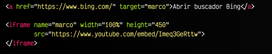
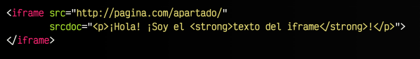
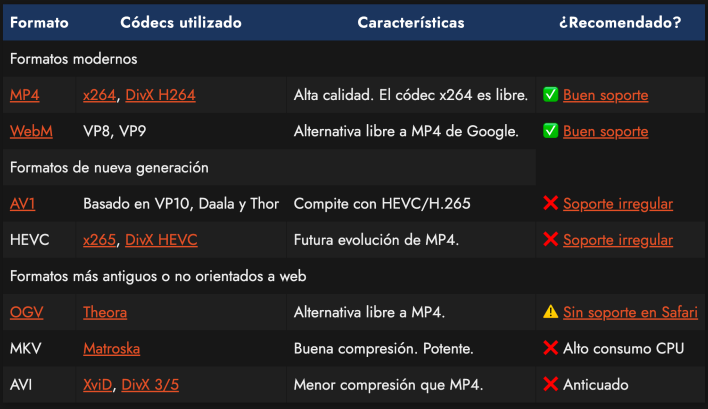
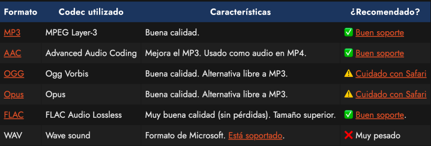

# Etiquetas multimedia

## Etiquetas de contenido incrustado
- Normalmente se usarán para cargar contenido externo.
- También se puede cargar contenido de la misma web.
- Es una referencia a un recurso almacenado en otra ubicación
- Al estar enlazado, garantiza que si el original cambia, nuestra web mostrará la versión actualizada.
- Podemos incrustar contenido como objetos multimedia, bloques de código HTML con contenidos diseñados por terceros e incluso webs enteras.
- Usaremos dos tipos de etiquetas:
    - `<embed>`
    - `<iframe>`

## Etiqueta `<embed>` (desuso)
- Podemos incrustar casi cualquier tipo de recurso.
    - Documentos html -> mejor usar `<iframe>`
    - Imágenes -> mejor usar ``
    - Vídeos -> mejor usar `<videp>`
    - Audio -> mejor usar `<audio>`
    - Flash -> En desuso.
    - Controles ActiveX
### Atributos
- `src`: la URI del recurso que será incrustado y reproducido o ejecutado por el pulg-in.
- `type`: tipo de contenido (también conocido como tipo de medio de internet o tipo MIME)
- `width` y ` height`: determinan el tamaño del contenedor en el que se va a mostrar el contenido.

- [Ver documentación `<embed>` W3C](https://www.w3schools.com/tags/tag_embed.asp)

## Etiqueta `<iframe>`
- Representa un contexto de navegación anidado.
- Es una ventana que permite acceder a un recurso que se encuentra ubicado en un contexto distinto a la página que se está mostrando en el navegador.
- Básicamente, permite incrustar un documento o parte de un documento dentro de una página HTML.

- [Ver documentación `<iframe>` W3C](https://www.w3schools.com/html/html_iframe.asp)

### Atributos
- `src`: la URI del recurso incrustado.
- `sredoc`: contiene el código HTML que mostrar dentro del elemento `<iframe>`. Si existe este atributo, se impone a la referencia proporcionada por el atributo src.
- `sandbox`: permite proporcionar restricciones al documento incrustado en el elemento `<iframe>` con objeto de mejorar la seguridad de la página.
- `<allow>`: directivas referentes a permisos de acceso o determinados elementos del dispositivo físico, tales como el acelerómetro, la cámara o la geolocalización.
- `<allowfullscreen>`: si existe, permite al contenido incrustado ocupar la pantalla completa.
- `<width y height>`: permite indicar el ancho y el alto en píxeles.
- `<loading>`: con el valor `lazy` el contenido se carga cuando se haga visible, con el valor `eager`(valor por defecto) el contenido se cargará inmediatamente.

> [!NOTE]
> ¿Pero qué ocurre si queremos colocar contenido de una web externa?
> Por ejemplo, servicios como Youtube, Vimeo, SoundCloud, SlideShare u otros sitios similares.
> Se trata de servicios que ofrecen contenido externo para incrustar en nuestras páginas web, pero lo que nos proporcionan no son imágenes, video o audios en formato que reconozca el navegdor, sino un enlace con contenido HTML muy diverso, que puede incluir JavaScript, CSS, imágenes , videos y muchos otros recursos.

#### Content - Security - Policy (CSP)
- El CSP es una medida de protección que se activa en los servidores del sitio web, en el cual se acepta o rechaza determinados llamados que vienen desde fuera, como interacciones entre servicios.
- Establece que un sitio web pueda o no ser embebida en otro sitio web.
- [Ver documentación CSP W3C](https://www.w3.org/TR/CSP3/)

---
#### Ejemplos


- [Ver código iframe externo](html/iframe/ejercicio4.html)

- [Ver código iframe interno](html/iframe/ejercicio5.html)

- [Ver código iframe Youtube](html/iframe/ejercicio6.html)

- [Ver código iframe Google Maps](html/iframe/ejercicio6.html)
---

### Extra
- **Atributo `name`**
    - Es posible utilizar el atributo name en nuestro `<iframe>` para darle un nombre al marco y cargar direcciones URL diferentes a través de una etiqueta de enalce `<a>`, haciendo referencia al marco a tracés del atributo `<target>`

<br>
<div style="text-align: center;">
    
</div><br>

- [Ver código iframe atributo name](html/iframe/ejercicio8.html)
<br><br>

- **Atributo `srcdoc`**
    - Por otro lado, el atributo `srcdoc` nos permite indicar directamente el código fuente del iframe en su valor, algo que puede ser interesante para crear contenido autogenerado a demanda.

<br>
<div style="text-align: center;">
    
</div><br>

--- 

## Etiqueta `<video>`
- En HTML5 se introduce la interesante posibilidad de mostrar videos directamente desde nustro navegador.
- Lo navegadores son capaces de msotrar imágenes, reproducir videos y audio.

### Atributos
- `src`: Archivo o URL del video a reproducir. Obligatoria si no tiene etiquetas dentro.
- `width`: Indicar el tamaño de ancho del video.
- `height`: Indicar el tamaño de alto del video.

### Atributos de control
- `autoplay`: Comienza a reproducir el video automáticamente. Ojo, está sujeto a normas del navegador. (muy limitado)
- `loop`: Vuelve a iniciar el video cuando finaliza su reproducción (en bucle).
- `muted`: Establece que el video se reproduzca con sonido muteado.
- `controls`: Muestra los controles de reproducción (por defecto no se muestran)
- `playsinline`: Reproduce el video en línea, es decir, en su área de reproducción.

### Atributos de precarga
- `poster`: Muestra una imagen a modo de presentación.
- `preload`: Indica como realizar la precarga del video.

### Formatos
<div style="text-align: center;">
    
</div>

#### Uso de source (cada vez menos usado. Mejor usar mp4)
```html
<video width="640" height="480">
    <source src="video.mp4" type="video/mp4" />
    <source src="video.webm" type="video/webm"
    <source src="video.ogv" type="video/ogg"
    
    Su navegador no soporta contenido multimedia.
</video>
```

- [Ver documentación video W3C](https://www.w3schools.com/html/html5_video.asp)

- [Ver código etiqueta video](html/video_audio/ejercicio9.html)

---
## Etiqueta `<video>`
- Lo mismo que la etiqueta video pero con audio.

### Formatos
<div style="text-align: center;">
    
</div>

- [Ver documentación audio W3C](https://www.w3schools.com/html/html5_audio.asp)
- [Ver código etiqueta audio](html/video_audio/ejercicio10.html)

---
## Etiqueta `<canvas>`
- Se utilizará para que librerías gráficas usen este contenedor a modo de lienzo par apoder dibujar y montar gráficos (JS)

- [Ver documentación canvas W3C](https://www.w3schools.com/html/html5_canvas.asp)

---
## Etiqueta `<map>` y `<area>`
- Se utilizan para realizar secciones de una imagen que puedan enlazar a diferentes secciones.

- [Ver documentación map y area W3C](https://www.w3schools.com/tags/tag_map.asp)

