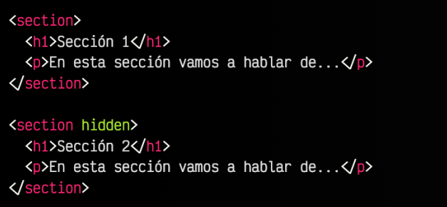

# Etiquetas interacticas.
- Serán un conjunto de etiquetas que sirven para que el usuario pueda interactuar con nuestro contenido.
- Con ellas se podrán desencadenar algunas acciones en la web.
- Vienen a suplir, características que únicamente podíamos hacer anteriormente con JS
- Todavía están bastante verdes, pero poco a poco mejoran.
- El ejemplo más claro de etiquetas interactivan pueden ser todas las del formulario.
- `Select`, `checkbox`, `radiobuton`, etc
- Atributos requedios, comprobación de datos, etc
- Su funcionamiento es nativo del navegador.

>[!WARNING]
> Cuidado con usarlas sin sentido.
> Antes de usar una etiqueta nueva debemos comprobar su conpatibilidad.
> Source: [Can i Use](https://caniuse.com/)

## Ocultación semántica
- Cuando queremos ocultar un elemento lo hacemos con CSS utilizando las propiedades `display:none`, `visibility:hidden`, `opacity:0` o alguna similar.
- Lo ideal sería tener una forma de saber si semánticamente tiene sentido que un elemento esté oculto.
- Con el `atributo hidden` hacemos desaparecer visualmente un elemento HTML( y todo su contenido, si está en una etiqueta contenedora).
- Hasta ahora, para realizar una tarea teníamos que recurrir a CSS.
- El `atributo hidden` hará que el elemento que lo incorpore tendra un `display:none` por defecto.
- Podremos cambiar el estilo mediante CSS si lo deseamos.

    <div style="text-align: center;">
    
    </div><br>

- [Ver ejemplo código hidden](html/interactivas/ejercicio11.html)


---

## Etiquetas `details` y  `summary`
- En HTML5, aparecen alguna nuevas etiquetas que proporcionan características interactivas a una página o documento.
- En dichas etiquetas, el usuario debe tomar parte de forma activa para activarlas o utilizarlas.
- Una de ellas es el llamado `Acordeón HTML` o elemento deplegable.
    - Se trata de un elementoq ue muestra un texto y forma o icono identificativo que el usuario puede pulsar y desplegar una información por defecto contraída.

### `details`
- Proporciona la posibilidad de crear une elemento desplegable, que el usuario puede expandir o contrair para ver información inicialmente oculta.
- Se trata de una etiqueta contenedora que actía como un `<div>`, salvo que todo el contenido de esta etiqueta no se muestra inicialmente.
<br><br>
<div style="text-align: center;">
    
    </div>


### `summary`
- Podremos personalizar el texto Detalles que sale por defecto a la hora de usar una etiqueta `summary`
<br><br>
<div style="text-align: center;">
    
    </div><br>


- [Ver ejemplo código details y summary](html/interactivas/ejercicio12.html)

---

## Etiquetas `dialog` y  `popover`
- En HTML5 es posible crear ventanas de diaálogo personalizadas sin necesidad de Javascript ( o mediante muy poco Javascript), de forma nativa, e incluso crear ventanas modales.
- Usaremos la etiqueta `<dialog>` en dos modalidades:
    - **Ventana de diálogo**: Se denomina así a una ventana que cominica el sistema o máquina con el usuario, para anunciarle información y pedirle confirmación, pedirle datos, etc...
    - **Ventana de diálogo modal**: Se denomina así a una variacion de la anterior, donde se obliga al usuario a atenderla y responderla, impidiendo hacer ninguna otra tarea mientras.
- A partir de HTML5.1, se incorpora la etiqueta `<dialog>` mediante la cuál podemos construir nuestras propoas ventanas de dialogo.
- Dichas ventanas pueden contener toda la información HTML que queramos: texto, imágenes, botones, video,... y ser personalizada mediante CSS.

- Apertura de `<dialog>`
    ```html
    <dialog open>
        <p>Esto es un ejemplo de mensaje de diálogo</p>
    </dialog>
    ```
- Clausura de `<dialog>`
    ```html
    <dialog id="alert-dialog" open>
         class="icon" src="infomartion.png" alt="Information icon"</img>
        <p>Esto es un ejemplo de mensaje de diálogo</p>
        <button onclick="document.getElementById('alert-dialog').close()">
            Cerrar
        </button>
    </dialog>
    ```

### `dialog modal`
- Por defecto, el fondo se oscure un poco.
- La ventana se suele centrar también verticalmente, para centrar la atención en ella.
- Sólo puede haber una ventana modal, ventanas normales pueden existir varias.
- Lo más importante: No deja interectuar con ningún otro elemento de la página.


### `popover`: Elementos emergentes.
- Los `popover` (pop over, salta por encima) son una nueva forma en HTML5 de crear elemento emergentes.
- Contenido que aparecerá al usuario por encima del contenido que ya estsaba visualizando, para llamar su atención temporalmente.
- **Atributos:**
    - `popover`Convierte el elemento HTML en un potencial contenido emergente. Por defecto, valor AUTO.
    - `popovertarget`: Indica el **id** del elemento que queremos manipular.
    - `popovertargetaction`: Indica la acción que se realizará sobre el elemento con el **id** anterior.

    ```html
        <button popovertarget="message" popovertargetaction="toggle">
            Mostrar</button>

        <div id="message" popover>
            <p>
                <strong>¡Alerta !</strong>: Has recibido un correo de 
                <strong>Afordin</strong>.
            </p>
        </div>
    ```

    - [Ver ejemplo código dialog](html/interactivas/ejercicio13.html)
    - [Ver ejemplo código popover](html/interactivas/ejercicio14.html)

---

## Etiquetas `datalist`
- Aunque conocemos los controles como la casillas de verificación, botones de opción (radio) o listas de selección hay situaciones en las que puede que ninguno de estos controles nos sirvan.
- Ejemplo: Una opción  de varias posibles, pero abierta a que se añadan más opciones por parte del usuario.
    - Esto sería una mezcla entre un campo `<input>` de testo y una lista desplegable `<select>`
- La etiqueta `<datalist>` debe indicarse con un atributo id para identificarse.
- En su interior incluiremos varias etiquetas `<option>` para añadir opciones, al igual que lo hacemos con `<selct>`
    ```html
    <datalist id="items">
        <option value="1">Opción 1</option>
        <option value="2">Opción 2</option>
    </datalist>
    ```
    - [Ver ejemplo código datalist](html/interactivas/ejercicio15.html)

---

## library `select2`
- Se utilizará para tener un select con valores predecibles y con ayuda contextual según vaya rellenando.
- No es nativo del navegador. Usa JS.
- Necesitamos instalarlo.
- Depende Jquery

```html
<select class="js-example-basic-single" name="state">
  <option value="AL">Alabama</option>
    ...
  <option value="WY">Wyoming</option>
</select>
```
- Instalación
```html
<link href="https://cdn.jsdelivr.net/npm/select2@4.1.0-rc.0/dist/css/select2.min.css" rel="stylesheet" />
<script src="https://cdn.jsdelivr.net/npm/select2@4.1.0-rc.0/dist/js/select2.min.js"></script>
```
- Jquery dependence (CDN)
```html
<script src="https://code.jquery.com/jquery-3.7.1.min.js" integrity="sha256-/JqT3SQfawRcv/BIHPThkBvs0OEvtFFmqPF/lYI/Cxo=" crossorigin="anonymous"></script>
```

- Inicialización `Select2`
```html
// In your Javascript (external .js resource or <script> tag)
$(document).ready(function() {
    $('.js-example-basic-single').select2();
});
```

- [Ver documentación oficial select2](https://select2.org/)
- [Ver documentación oficial JQuery](https://jquery.com/)
- [Ver código ejemplo select2](html/interactivas/ejercicio16.html)

---

## Etiqueta `wysiwyg`
- Editor de contenido htm en línea para nuestros `<textarea>` con formato.
- Ejemplo: `CKEditor`

- [Ver documentación oficial CKEditor](https://ckeditor.com/docs/ckeditor5/latest/getting-started/installation/quick-start.html)
- [Ver código ejemplo CKEditor](html/interactivas/ejercicio17.html)


