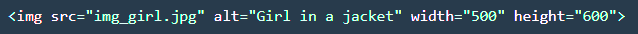
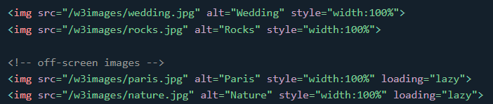
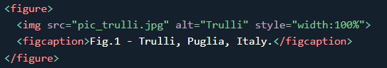
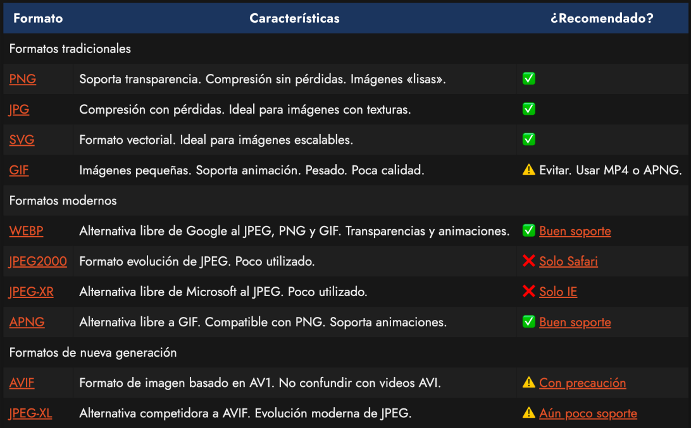
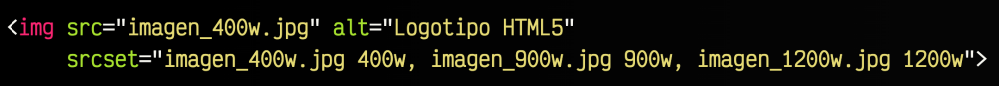
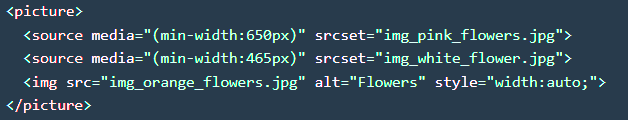
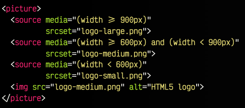

# Imágenes en la web
- Importante diferenciar entre **Contenido vs Presentación**.
- Hay que distinguir entre las imágenes que forman parte del contenido y las imágenes de decoración.
- DEpendiendo de la naturaleza que tenga no las trateremos igual.
    - Si la imagen es de contenido la introduciremos con HTML
        - ``
    - Si la imagen es de decoración lo haremos con CSS
        - `CSS --> (bacground-image)`

## Etiqueta ``
- `src` : Indica el nombre o la URL de la imagen a mostrar. **Atributo obligatorio**
- `alt` : Establece un texto alternativo que describa la imagen o mostrar. **Atributo obligatorio**
- `width` : Indica el **ancho** de la imagen en píxeles (sin la unidad). Se puede hacer desde CSS pero es conveniente indicarlo en HTML también.
- `height` : Indica el **alto** de la imagen en píxeles (sin la unidad). Se puede hacer desde CSS pero es conveniente indicarlo en HTML también.

<br>
<div style="text-align: center;">
  
</div> 
<br>

>[!NOTE]
> Si le indicamos en el HTML las dimensiones, cuando se está cargando la imagen ya tiene reservado el sitio y no tenemos desplazamientos de texto según carga.


### **La importancia de las urls**
- Diferencia entre una url absoluto y url relativa.
- Cómo enlazar correctamente ficheros dentro de nuestro poryecto.
- Directrio "." (donde estoy) y directorio ".." (directorio padre) 


[Ver código de ejemplo](html/ejercicio1.html)

---

###  Etiqueta `<loading>`
- Carga perezosa 
- Valores: 
    - eager: el navegador descarga inmediátamente.
    - lazy: el navegador pospone la descarga hasta que es visible.

<br>
<div style="text-align: center;">
  
</div> 
<br>

[Ver código de ejemplo](html/ejercicio2.html)

---

## Etiqueta `<figure>` y `<figcaption>`
- `figure` es un etiqueta de grupación para imágenes.
    - Encerrará a una etiqueta `` básica.
    - Se manejará mucho mejor con CSS en el futuro.
    - Recuerda que en la ilustración o figura, se pueden contener todo tipo de elementos, no solo imágenes.

- `<figcaption>` añade significado semántico a la imagen
    - Ayudará al atributo de `alt` del ``
    - Normalmente se utiliza como texto de pie de la imagen.

<div style="text-align: center;">
  
</div> 
<br>

[Ver código de ejemplo](html/ejercicio4.html)

---
---

## Formatos admitidos

<div style="text-align: center;">
  
</div> 
<br>

- Los más usados son PNG, JPG, SVG y GIF
    - PNG ocupa más pero admite transparencias, tiene canal Alpha. Puede haber parte de la imagen en la que no haya informaciòn y se puede ver lo que hay detrás.
    - JPG tiene mucha más compresión pero no permite transparencias.
    - SVG es un formato vectorial. La imagen no está guardada como mapa de bits, sino que es una forma matemática que va pintando imágenes. Sirve para imágenes sin degradados excesivos, sin muchos cambios de tonalidades de color. Tipo logos, tipografías.
    - GIF sirve para pequeñas animaciones.

- Formato morderno
    - WEBP Alternativa libre de Google con más compresión que JPG.

- Cualquier otro formato no mostrado en esta lista no está recomendado para el uso en la WEB.
    - Formatos como BMP, TIFF, RAW, NEF, PSD, CDR son formatos no orientados para su uso en la web, además de ser propietarios y muy pesados.
    
---
---
---

# Imágenes responsive y alternativas
- En algunas ocasiones nos podría interesar indicar al navegador que debe descargarse una imagen concreta si el dispositivo tiene una cierta resolución(móvil), pero en el caso de ser un dispositivo de alta resolución (ordenador) descargue una imagen de mayor resolución
- De esta forma no desperdiciamos recursos ni tiempo de descarga.
- Lo mismo pasa con pantallas que tengan una densidad de píxeles mayor, y puedan mostrar imágenes a mejores resoluciones.

## Atributos HTML responsives.
- `srcset`: Indica un conjunto de imágenes y cargará una cuando se cumplan ciertos criterios.
    - Indicamos una lista de recursos separados por como, que se utilizarán en situaciones concretas cuando se cumplan determinados criterios.
    - Formato:
        <div style="text-align: center;">
        
        </div> 

            -> Ancho de pantalla en píxeles, seguidos de una letras w.

            -> Densidad de píxeles con decimales, seguido de la letra x.

- `sizes`: Indica un conjunto de condiciones de medios para aplicar al srcset.

<br>
<div style="text-align: center;">
    
</div><br>


## Etiqueta `<picture>` y `<source>`
- HTML5.1 incorpora un nuevo sistema para utilizar imágenes en nuestros documentos HTML de forma mucho más flexible que la etiqueta `` tradicional.
- Esta nueva etiquita nos permitirá mostrar imágenes dependiendo de nuestras necesidades.
- Uno de los principales problemas al utilizar la etiqueta `` es que si utilizamos un formato moderno puede ser que no esté soportados por algunos navegadores.
- Nos falta la posibilidad de establecer alternativas, para poder usar el formato correcto según sean las características del visitante y así poder aprovecharnos de las ventajas de formatos nuevos si hay soporte ( menor peso, mayor calidad, ...)

<br>
<div style="text-align: center;">
    
</div><br>

- `<picture>`: Agrupará una serie de imágenes. Etiqueta contenedora.
- `<source>`: Mostrará la imagen que cumpla una serie de criterios opcionales.

    ```html
        <picture>
            <!-- Aquí colocamos posibles imágenes candidatas <source> -->
            <!-- Aquí colocamos la imagen  a utilizar por defecto -->
        </picture>
    ``` 
    ```html 
        <picture>
            <source srcset="imagen.avif"> 
            <source srcset="imagen.webp">
             
        </picture>
    ```

## Imágenes responsive - 2º parte -
- Otra ventaja:
    - Usando `<picture>` podemos crear imágenes responsive que cambian dependiendo de la característica de las media queries(CSS)

<div style="text-align: center;">
    
</div><br>
